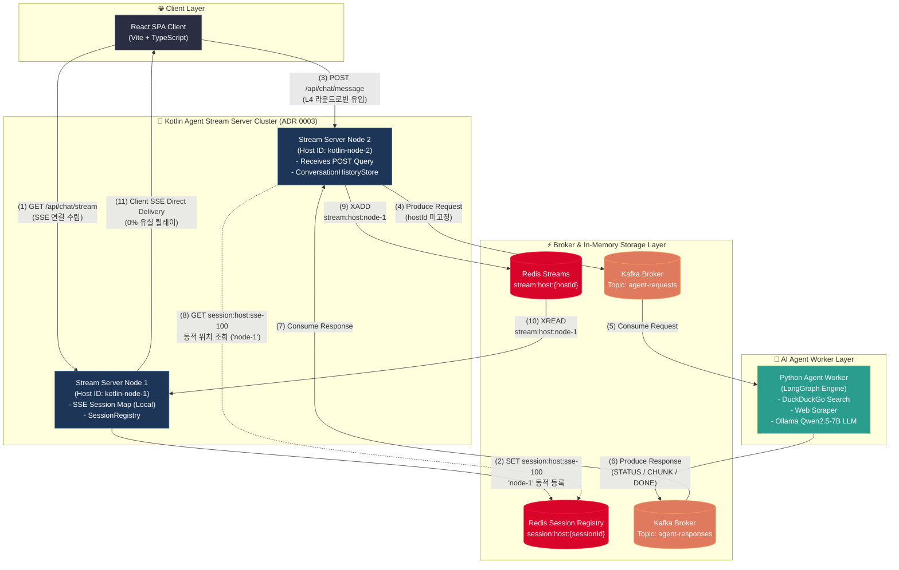
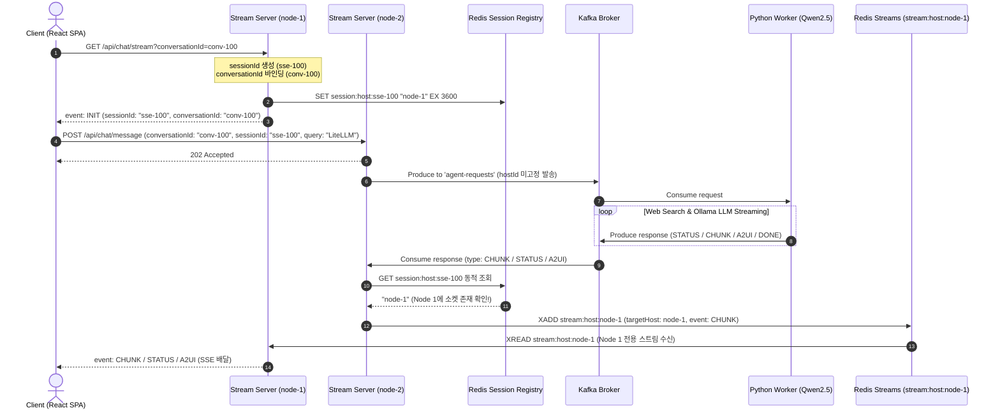
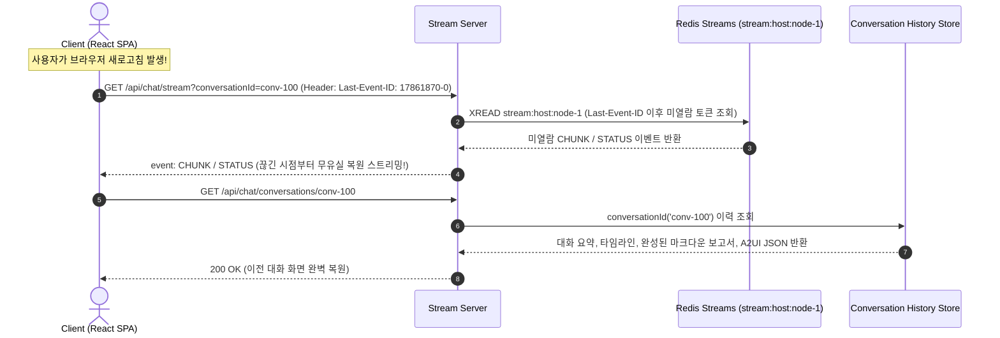

# Real-time AI Researcher Agent - System Architecture & Sequence Flow

이 문서는 프로젝트의 전체 시스템 구조, 컴포넌트 간 통신 아키텍처, 데이터 플로우, 세션/대화 분리 모델, ADR 0003 노드별 Redis Streams 라우팅 및 컨슈머 동적 세션 조회를 포함한 **현행화된 최종 아키텍처 명세**입니다.

관련 문서: [요구사항 정의서](1.requirements.md) | [기술 명세서](3.spec.md) | [구현 계획서](4.plan.md) | [ADR 0003 노드별 스트림 라우팅](adr/0003-redis-streams-bucketing-and-dynamic-session-routing.md)

---

## 1. 아키텍처 개요 및 도메인 모델 분리

본 시스템은 동시 연결 처리가 우수한 **JVM 리액티브 모델(Kotlin WebFlux Agent Stream Server)**과 **파이썬 에이전트 워커(LangGraph Worker)**를 비동기 메시지 브로커(Kafka), 노드별 레디스 스트림(Redis Streams `stream:host:{hostId}`) 및 대화 영속성 저장소로 연결한 **0% 유실 무중단 이벤트 구동형 대화 아키텍처**입니다.

### 🔑 식별자 및 아키텍처 구조 (Identity & Dynamic Routing Model)
* **`sessionId` (Stream Connection ID)**: 네트워크 SSE 연결 생명주기를 다루는 소켓 식별자입니다. 새로고침 시 새로 생성됩니다.
* **`conversationId` (Business Conversation ID)**: 리서치 대화 스레드의 생명주기를 다루는 도메인 식별자입니다. 새로고침하더라도 동일한 대화 이력 및 리포트를 복원합니다.
* **`hostId` (Server Instance ID)**: 코틀린 스트리밍 서버 노드의 유니크 식별자입니다 (예: `kotlin-node-1`).
* **Redis Session Registry (`session:host:{sessionId}`)**: SSE 연결 시점에 소켓 위치를 등록하여, L4/L7 라운드로빈으로 질문이 다른 노드로 유입되어도 응답 수신 시점(Consumer)에 실재 소켓 노드를 동적 추적하여 무중단 배달합니다.
* **Node-based Redis Stream (`stream:host:{hostId}`)**: 각 서버 노드가 본인 이름의 레디스 스트림 단 1개만 `XREAD`로 지속 수신하여, **노드당 Redis 커넥션 수 상한을 정확히 1개로 고정**합니다.

---

## 2. 시스템 아키텍처 구성도 (Current Architecture Topology)

### 2.1. Mermaid 시스템 토폴로지 다이어그램



### 2.2. 아스키 시스템 컴포넌트 흐름도

```
 [ Client Browser ]
  (Vite + React SPA)
         │
         │ (1) GET /api/chat/stream?conversationId={id} (Last-Event-ID)
         │      ──► Node 1에 SSE 연결 수립 & Redis 세션 등록 ("session:host:sse-100" -> "node-1")
         │
         │ (2) POST /api/chat/message (L4 라운드로빈 유입)
         │      ──► 질문 전송 (Node 2로 질문 유입)
         ▼
┌─────────────────────────────────────────────────────────────────────────────────┐
│ Kotlin Agent Stream Server Cluster                                              │
│                                                                                 │
│  ┌─────────────────────────────┐               ┌─────────────────────────────┐  │
│  │ Stream Server Node 1        │               │ Stream Server Node 2        │  │
│  │ (Host ID: kotlin-node-1)    │               │ (Host ID: kotlin-node-2)    │  │
│  │                             │               │                             │  │
│  │  - SSE Session Map (Local)  │               │  - Receives POST message    │  │
│  │  - RedisSessionRegistry     │               │  - ConversationHistoryStore │  │
│  └──────────────▲──────────────┘               └──────────────┬──────────────┘  │
└─────────────────┼─────────────────────────────────────────────┼─────────────────┘
                  │                                             │ (3) Produce Request (hostId 미고정)
                  │                                             ▼
                  │                                 ┌───────────────────────┐
                  │                                 │ Kafka Broker          │
                  │                                 │ Topic: agent-requests │
                  │                                 └───────────┬───────────┘
                  │                                             │ (4) Consume Request
                  │                                             ▼
                  │                    ┌──────────────────────────────────────────┐
                  │                    │ Python Agent Worker (LangGraph Engine)   │
                  │                    │  - DuckDuckGo -> Scraper -> Ollama LLM   │
                  │                    └────────────────────────┬─────────────────┘
                  │                                             │ (5) Produce Response
                  │                                             ▼
                  │                                 ┌───────────────────────┐
                  │                                 │ Kafka Broker          │
                  │                                 │ Topic: agent-responses│
                  │                                 └───────────┬───────────┘
                  │ (7) Node 1 전용 Stream 읽기 (XREAD)         │ (6) Consume Response & Redis 동적 위치 조회!
                  │     (stream:host:kotlin-node-1)             │     "sse-100 소켓이 Node 1에 있구나!"
                  │                                             ▼
      ┌───────────┴─────────────────┐               ┌───────────────────────────┐
      │ Redis Streams               │ ◄── (XADD) ── │ Stream Server Consumer    │
      │ Key: stream:host:node-1     │               │ Node 2 (또는 인근 노드)   │
      └─────────────────────────────┘               └───────────────────────────┘
```

---

## 3. 시퀀스 플로우 (Sequence Diagram)

### 3.1. 대화 수립, 세션 위치 등록 및 동적 라우팅 플로우



### 3.2. 새로고침 시 W3C `Last-Event-ID` 복원 및 대화 이력 조회 플로우



---

## 4. 핵심 데이터 구조 및 REST API 명세

### 4.1. Redis 데이터 키 구조
1. **`session:host:{sessionId}` (Key-Value)**: `kotlin-node-1` (소켓 보유 노드 ID, TTL 3600초)
2. **`stream:host:{hostId}` (Redis Streams)**: 노드별 전용 무유실 레디스 스트림

### 4.2. REST API 사양
* **`GET /api/chat/stream?conversationId={id}`**: SSE 스트림 커넥션 수립 (W3C `Last-Event-ID` 수신 시 미열람 토큰 리플레이 스트리밍)
* **`POST /api/chat/message`**: 질의 전송 (`conversationId`, `sessionId`, `query` 발송)
* **`POST /api/chat/action`**: A2UI 사용자 선택 액션 버튼 제출
* **`GET /api/chat/conversations`**: 이전 대화 목록 요약 조회
* **`GET /api/chat/conversations/{conversationId}`**: 특정 대화 상세 이력 및 완료 리포트 복원 조회
