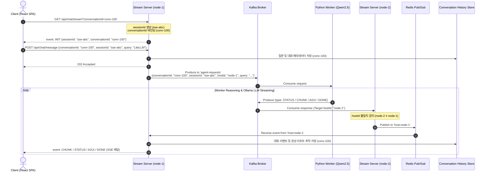
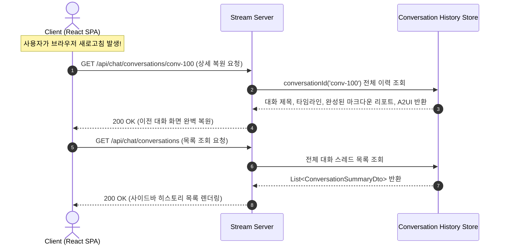

# Real-time AI Researcher Agent - System Architecture & Sequence Flow

이 문서는 프로젝트의 전체 시스템 구조, 컴포넌트 간 통신 아키텍처, 데이터 플로우, 세션/대화 분리 모델 및 시퀀스 흐름(Sequence Diagram)을 기술합니다.

관련 문서: [요구사항 정의서](1.requirements.md) | [기술 명세서](3.spec.md) | [구현 계획서](4.plan.md) | [ADR 0001 세션 라우팅](adr/0001-multi-node-multi-node-routing.md)

---

## 1. 아키텍처 개요 및 도메인 모델 분리

본 시스템은 동시 연결 처리가 우수한 **JVM 리액티브 모델(Kotlin WebFlux Agent Stream Server)**과 **파이썬 에이전트 워커(LangGraph Worker)**를 비동기 메시지 브로커(Kafka), 레디스(Redis Pub/Sub) 및 대화 영속성 저장소로 연결한 **이벤트 구동형 대화 아키텍처**입니다.

### 🔑 식별자 역할 분리 (Identity Model)
* **`sessionId` (Stream Connection ID)**: 네트워크 SSE 연결 생명주기를 다루는 소켓 식별자입니다. 새로고침 시 새로 생성됩니다.
* **`conversationId` (Business Conversation ID)**: 리서치 대화 스레드의 생명주기를 다루는 도메인 식별자입니다. 새로고침 시에도 동일한 ID로 대화 및 리포트를 복원하고 이어나갈 수 있습니다.

---

## 2. 시스템 아키텍처 구성도

```
 [ Client Browser ]
  (Vite + React SPA)
         │
         │ (1) GET /api/chat/stream?conversationId={id} ──► SSE 커넥션 수립 (sessionId & conversationId 바인딩)
         │ (2) POST /api/chat/message                   ──► 질문 등록 (conversationId & sessionId 포함)
         ▼
┌─────────────────────────────────────────────────────────────────────────────────┐
│ Kotlin Agent Stream Server Cluster                                              │
│                                                                                 │
│  ┌─────────────────────────────┐               ┌─────────────────────────────┐  │
│  │ Stream Server Node 1        │               │ Stream Server Node 2        │  │
│  │ (Host ID: kotlin-node-1)    │               │ (Host ID: kotlin-node-2)    │  │
│  │                             │               │                             │  │
│  │  - SSE Session Map (Local)  │               │  - SSE Session Map (Local)  │  │
│  │  - Conversation Repository  │               │  - Conversation Repository  │  │
│  └──────────────┬──────────────┘               └──────────────▲──────────────┘  │
└─────────────────┼─────────────────────────────────────────────┼─────────────────┘
                  │ (3) Produce Request                         │ (6) Consume Response & History Save
                  ▼                                             │
      ┌───────────────────────┐                     ┌───────────┴───────────┐
      │ Kafka Broker          │                     │ Kafka Broker          │
      │ Topic: agent-requests │                     │ Topic: agent-responses│
      └───────────┬───────────┘                     └───────────▲───────────┘
                  │                                             │
                  │ (4) Consume Request                         │ (5) Produce Response & Tokens
                  ▼                                             │
      ┌─────────────────────────────────────────────────────────┴─────────────────┐
      │ Python Agent Worker (LangGraph & Ollama Qwen2.5-7B)                       │
      │  - Query Analysis -> DuckDuckGo Search -> Web Scraper -> Ollama Stream   │
      └───────────────────────────────────────────────────────────────────────────┘
                                        │
                                        │ (7) Host ID 불일치 시 Redis Pub/Sub 라우팅
                                        ▼
                         ┌─────────────────────────────┐
                         │ Redis Pub/Sub               │
                         │ Channel: host:kotlin-node-1 │
                         └──────────────┬──────────────┘
                                        │ (8) Publish Message
                                        ▼
                         [ Stream Server Node 1 ]
                                        │ (9) SSE Stream Response & History Store
                                        ▼
                                [ Client Browser ]
```

---

## 3. 시퀀스 플로우 (Sequence Diagram)

### 3.1. 대화 수립, 질문 전송 및 실시간 이력 저장 플로우



### 3.2. 새로고침 시 대화 복원 및 이전 대화 목록/상세 조회 플로우



---

## 4. 핵심 데이터 모델 및 API 사양 요약

### 4.1. REST API 사양
* **`GET /api/chat/stream?conversationId={id}`**: SSE 스트림 커넥션 수립 (기존 대화 이어서 스트리밍 가능)
* **`POST /api/chat/message`**: 질의 전송 (`conversationId`, `sessionId`, `query` 실어 발송)
* **`GET /api/chat/conversations`**: 이전 대화 목록 조회
* **`GET /api/chat/conversations/{conversationId}`**: 특정 대화 상세 이력 및 완료 리포트 복원 조회
