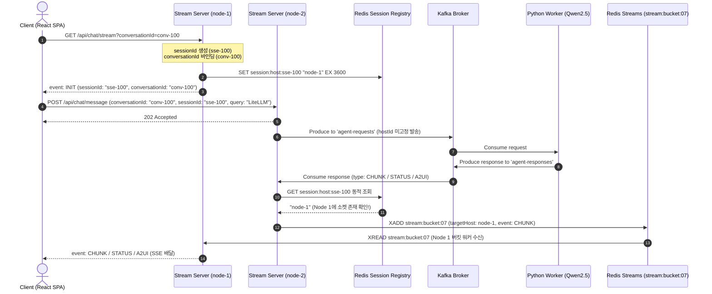

# Real-time AI Researcher Agent - System Architecture & Sequence Flow

이 문서는 프로젝트의 전체 시스템 구조, 컴포넌트 간 통신 아키텍처, 데이터 플로우, 세션/대화 분리 모델, ADR 0002 버킷팅 Redis Streams 및 컨슈머 동적 세션 라우팅 시퀀스 흐름을 기술합니다.

관련 문서: [요구사항 정의서](1.requirements.md) | [기술 명세서](3.spec.md) | [구현 계획서](4.plan.md) | [ADR 0002 버킷팅 라우팅](adr/0002-redis-streams-bucketing-and-dynamic-session-routing.md)

---

## 1. 아키텍처 개요 및 도메인 모델 분리

본 시스템은 동시 연결 처리가 우수한 **JVM 리액티브 모델(Kotlin WebFlux Agent Stream Server)**과 **파이썬 에이전트 워커(LangGraph Worker)**를 비동기 메시지 브로커(Kafka), 레디스 버킷 스트림(Redis Streams `stream:bucket:{00~15}`) 및 대화 영속성 저장소로 연결한 **무유실 이벤트 구동형 대화 아키텍처**입니다.

### 🔑 식별자 및 아키텍처 구조 (Identity & Bucketing Model)
* **`sessionId` (Stream Connection ID)**: 네트워크 SSE 연결 생명주기를 다루는 소켓 식별자입니다. 새로고침 시 새로 생성됩니다.
* **`conversationId` (Business Conversation ID)**: 리서치 대화 스레드의 생명주기를 다루는 도메인 식별자입니다.
* **Stream Bucketing (`stream:bucket:{00~15}`)**: `conversationId`를 16개 버킷으로 해시 분할하여 동시 대화방 수에 상관없이 Redis XREAD 커넥션 수 상한을 16개 이하로 통제합니다.

---

## 2. 시스템 아키텍처 구성도 (ADR 0002)

```
 [ Client Browser ]
  (Vite + React SPA)
         │
         │ (1) GET /api/chat/stream?conversationId={id} (Last-Event-ID)
         │      ──► Node 1에 SSE 연결 및 Redis 세션 등록 ("session:host:sse-100" -> "node-1")
         │
         │ (2) POST /api/chat/message (L4 라운드로빈 유입)
         │      ──► 질문 전송 (Node 2로 질문 유입)
         ▼
┌─────────────────────────────────────────────────────────────────────────────────┐
│ Kotlin Agent Stream Server Cluster                                              │
│                                                                                 │
│  ┌─────────────────────────────┐               ┌─────────────────────────────┐  │
│  │ Stream Server Node 1        │               │ Stream Server Node 2        │  │
│  │ (Host ID: kotlin-node-1)    │               │ (Host ID: kotlin-node-2)    │  │
│  │                             │               │                             │  │
│  │  - SSE Session Map (Local)  │               │  - Receives POST message    │  │
│  └──────────────▲──────────────┘               └──────────────┬──────────────┘  │
└─────────────────┼─────────────────────────────────────────────┼─────────────────┘
                  │                                             │ (3) Produce Request (hostId 미고정)
                  │                                             ▼
                  │                                 ┌───────────────────────┐
                  │                                 │ Kafka Broker          │
                  │                                 │ Topic: agent-requests │
                  │                                 └───────────┬───────────┘
                  │                                             │ (4) Consume Request
                  │                                             ▼
                  │                    ┌──────────────────────────────────────────┐
                  │                    │ Python Agent Worker (LangGraph Engine)   │
                  │                    └────────────────────────┬─────────────────┘
                  │                                             │ (5) Produce Response
                  │                                             ▼
                  │                                 ┌───────────────────────┐
                  │                                 │ Kafka Broker          │
                  │                                 │ Topic: agent-responses│
                  │                                 └───────────┬───────────┘
                  │ (7) Redis Stream 읽기 (XREAD)               │ (6) Consume Response & Redis 동적 위치 조회!
                  │     (stream:bucket:07)                      │     "sse-100 소켓이 Node 1에 있구나!"
                  │                                             ▼
      ┌───────────┴───────────┐                     ┌───────────────────────────┐
      │ Redis Streams         │ ◄─── (XADD) ─────── │ Stream Server Consumer    │
      │ Key: stream:bucket:07 │                     │ Node 2 (또는 인근 노드)   │
      └───────────────────────┘                     └───────────────────────────┘
```

---

## 3. 시퀀스 플로우 (Sequence Diagram)

### 3.1. 대화 수립, 세션 위치 등록 및 동적 라우팅 플로우



---

## 4. 핵심 REST API 사양

* **`GET /api/chat/stream?conversationId={id}`**: SSE 스트림 커넥션 수립 (W3C `Last-Event-ID` 수신 시 미열람 토큰 리플레이 스트리밍)
* **`POST /api/chat/message`**: 질의 전송 (`conversationId`, `sessionId`, `query` 발송)
* **`GET /api/chat/conversations`**: 이전 대화 목록 조회
* **`GET /api/chat/conversations/{conversationId}`**: 특정 대화 상세 이력 및 완료 리포트 복원 조회
