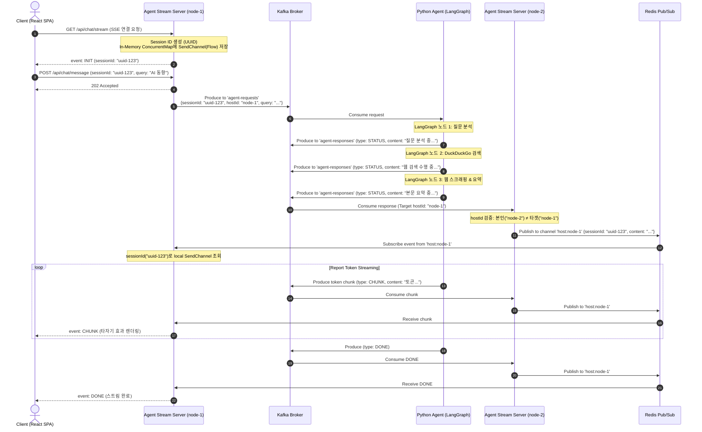

# Real-time AI Researcher Agent - System Architecture & Sequence Flow

이 문서는 프로젝트의 전체 시스템 구조, 컴포넌트 간 통신 아키텍처, 데이터 플로우 및 시퀀스 흐름(Sequence Diagram)을 상세히 기술합니다.

관련 문서: [요구사항 정의서](1.requirements.md) | [기술 명세서](3.spec.md) | [구현 계획서](4.plan.md) | [ADR 0001 세션 라우팅](adr/0001-multi-node-session-routing.md) | [ADR 0002 Coroutine Flow](adr/0002-kotlin-sse-coroutine-flow.md)

---

## 1. 아키텍처 개요

본 시스템은 동시 연결 수(Concurrency) 처리가 우수한 **JVM 리액티브 모델(Kotlin WebFlux Agent Stream Server)**과 풍부한 AI/ML 패키지 생태계를 가진 **파이썬 에이전트(LangGraph Worker)**를 격리·결합한 **비동기 이벤트 구동 아키텍처(Event-Driven Architecture)**를 지향합니다.

* **Front-end / Stream Server 분리**: 프론트엔드는 독립된 SPA(Vite + React)로 구동되며, 코틀린 스트리밍 서버는 비동기 스트리밍(SSE) 커넥션 관리와 메시지 라우팅만 담당합니다.
* **Message Broker (Kafka)**: 질문 요청(`agent-requests`)과 처리 응답/토큰 청크(`agent-responses`)를 비동기 큐로 완충하여 파이썬 워커의 부하가 스트리밍 서버에 직접 전달되지 않도록 격리합니다.
* **In-Memory Cache & Pub/Sub (Redis)**: 코틀린 스트리밍 서버가 여러 대(Multi-Node)로 스케일아웃되어도 사용자의 SSE 소켓을 쥐고 있는 올바른 인스턴스로 이벤트를 실시간 배달(Pub/Sub)합니다.

---

## 2. 시스템 아키텍처 구성도

```
 [ Client Browser ]
  (Vite + React SPA)
         │
         │ (1) GET /api/chat/stream  ──► SSE 커넥션 수립 & Session ID (UUID) 생성
         │ (2) POST /api/chat/message ─► 질문 등록 (Session ID 포함)
         ▼
┌─────────────────────────────────────────────────────────────────────────────────┐
│ Kotlin Agent Stream Server Cluster                                              │
│                                                                                 │
│  ┌─────────────────────────────┐               ┌─────────────────────────────┐  │
│  │ Stream Server Node 1        │               │ Stream Server Node 2        │  │
│  │ (Host ID: kotlin-node-1)    │               │ (Host ID: kotlin-node-2)    │  │
│  │                             │               │                             │  │
│  │  - SSE Session Map (Local)  │               │  - SSE Session Map (Local)  │  │
│  │  - Kafka Producer/Consumer  │               │  - Kafka Producer/Consumer  │  │
│  └──────────────┬──────────────┘               └──────────────▲──────────────┘  │
└─────────────────┼─────────────────────────────────────────────┼─────────────────┘
                  │ (3) Produce Request                         │ (6) Consume Response
                  ▼                                             │
      ┌───────────────────────┐                     ┌───────────┴───────────┐
      │ Kafka Broker          │                     │ Kafka Broker          │
      │ Topic: agent-requests │                     │ Topic: agent-responses│
      └───────────┬───────────┘                     └───────────▲───────────┘
                  │                                             │
                  │ (4) Consume Request                         │ (5) Produce Response
                  ▼                                             │
      ┌─────────────────────────────────────────────────────────┴─────────────────┐
      │ Python Agent Worker (LangGraph Multi-Step Engine)                        │
      │  - Query Analysis -> DuckDuckGo Search -> Web Scraper -> Summarize/Stream │
      └───────────────────────────────────────────────────────────────────────────┘
                                        │
                                        │ (7) Host ID 불일치 시 Redis Pub/Sub 라우팅
                                        ▼
                         ┌─────────────────────────────┐
                         │ Redis Pub/Sub               │
                         │ Channel: host:kotlin-node-1 │
                         └──────────────┬──────────────┘
                                        │ (8) Publish Message
                                        ▼
                         [ Stream Server Node 1 ]
                                        │ (9) SSE Stream Response
                                        ▼
                                [ Client Browser ]
```

---

## 3. 시퀀스 플로우 (Sequence Diagram)

클라이언트의 최초 연결부터 파이썬 에이전트의 멀티 스텝 웹 리서치, 그리고 다중 코틀린 노드 환경에서의 Redis Pub/Sub 라우팅을 거치는 전체 E2E 시퀀스 플로우입니다.



---

## 4. 핵심 데이터 및 이벤트 플로우 상세

### 4.1. 1단계: 세션 생성 및 SSE 연결 (Session Initialization)
1. 프론트엔드가 코틀린 스트리밍 서버 엔드포인트(`GET /api/chat/stream`)로 SSE 커넥션을 수립합니다.
2. 스트리밍 서버는 런타임에 UUID 기반의 `sessionId`를 생성하고, 내부 `ConcurrentHashMap<String, SendChannel>`에 저장합니다.
3. 생성된 `sessionId`를 포함한 `INIT` 이벤트를 클라이언트에 최초 전송하여 클라이언트가 자신의 세션 키를 인지하게 합니다.

### 4.2. 2단계: 비동기 작업 발행 (Async Task Producing)
1. 클라이언트는 질문 텍스트와 할당받은 `sessionId`를 실어 `POST /api/chat/message`를 호출합니다.
2. 스트리밍 서버는 동기식으로 응답을 대기하지 않고, 자신의 식별자(`hostId: kotlin-node-1`)와 `sessionId`, `query`를 메시지 객체로 조립하여 Kafka `agent-requests` 토픽으로 발행(Produce)합니다.
3. 클라이언트에는 즉시 `202 Accepted` 응답을 반환하여 HTTP 통신을 비동기로 완전 격리합니다.

### 4.3. 3단계: 파이썬 에이전트 추론 및 상태 송신 (Multi-Step Agent Loop)
1. 파이썬 워커는 Kafka `agent-requests` 토픽에서 메시지를 소비(Consume)합니다.
2. LangGraph 기반 제어 그래프를 실행하며 각 단계를 거칠 때마다 상태 메시지를 발행합니다:
   * **STATUS**: `Query Analysis` -> `DuckDuckGo Search` -> `Web Scraping` -> `Report Generation`
   * **CHUNK**: 보고서 작성 시 LLM에서 생성되는 토큰 스트림 조각
   * **ERROR / DONE**: 예외 발생 시 에러 메시지 또는 정상 완료 신호
3. 모든 메시지 메타데이터에는 요청받은 `sessionId`와 `hostId`가 그대로 유지됩니다.

### 4.4. 4단계: 분산 세션 라우팅 (Cross-Node Redis Pub/Sub Routing)
1. Kafka `agent-responses` 토픽은 코틀린 스트리밍 서버 인스턴스 그룹(Consumer Group)에 의해 분산 소비됩니다.
2. 메시지를 수신한 코틀린 노드(예: `kotlin-node-2`)는 메시지의 `hostId`가 본인의 ID인지 확인합니다.
3. **본인 노드인 경우**: 자신이 쥐고 있는 로컬 SSE 소켓으로 직접 메시지를 전송합니다.
4. **타 노드인 경우**: Redis Pub/Sub 채널 `host:{targetHostId}` (예: `host:kotlin-node-1`)로 해당 메시지를 Publish합니다.
5. `kotlin-node-1`은 기동 시 자신의 Redis 채널을 지속 구독(Subscribe)하고 있으므로, 메시지를 전달받아 클라이언트의 SSE 커넥션으로 최종 중계합니다.

---

## 5. 결합도 격리 및 예외 복원력 (Resilience)

* **파이썬 에이전트 장애 격리**: 파이썬 워커 프로세스가 다운되거나 LLM API 가 중단되더라도 Kafka 큐가 메시지를 보존하며, 앞단 서버의 HTTP/SSE 커넥션은 영향을 받지 않습니다.
* **타임아웃 핸들링**: 파이썬 워커에서 예외 발생 시 Kafka로 `type: ERROR` 메시지를 발행하며, 스트리밍 서버는 이를 수신하여 클라이언트에 에러 알림 후 안전하게 세션을 종료합니다.
* **노드 스케일아웃 자유도**: 코틀린 스트리밍 서버를 무한히 증설(Scale-out)해도 Redis Pub/Sub을 통한 Host ID 라우팅으로 세션 유실 없이 작동합니다.
