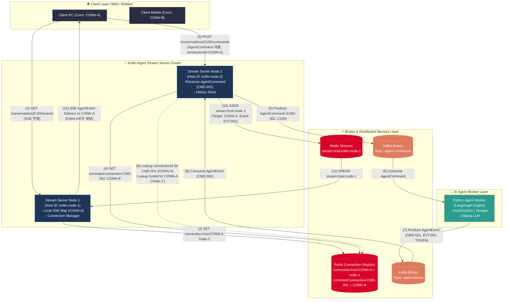
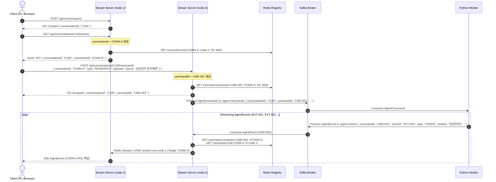
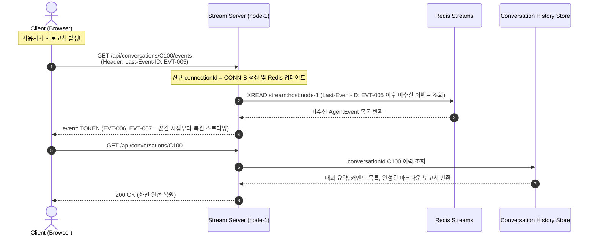

# Real-time AI Researcher Agent - System Architecture & Sequence Flow

이 문서는 프로젝트의 전체 시스템 구조, 컴포넌트 간 통신 아키텍처, 데이터 플로우, 도메인 모델(`AgentCommand`, `AgentEvent`) 및 4대 식별자 체계(`conversationId`, `commandId`, `connectionId`, `eventId`), Redis 분산 라우팅 아키텍처 명세입니다.

관련 문서: [요구사항 정의서](requirements.md) | [기술 명세서](spec.md) | [ADR 0003 노드별 스트림 라우팅](adr/0003-redis-streams-bucketing-and-dynamic-session-routing.md)

---

## 1. 도메인 모델 및 4대 핵심 식별자

본 시스템은 **이벤트 구동형 아키텍처(Event-Driven Architecture)**와 **CQRS 패턴**을 기반으로 클라이언트의 요청 명령인 **`AgentCommand`**와 에이전트가 발행하는 스트리밍 이벤트인 **`AgentEvent`**를 명확히 분리하여 처리합니다.

```text
               AgentCommand (CommandId)
Client (UI) ─────────────────────────────► Kotlin Stream Server
                                                 │
                                                 ▼ Kafka 'agent-commands'
                                            Python Worker
                                                 │
                                                 ▼ Kafka 'agent-events'
Client (UI) ◄───────────────────────────── Kotlin Stream Server
                 AgentEvent (EventId)
```

### 🔑 4대 핵심 식별자 모델 (Identity Model)

| 식별자 (ID) | 도메인 용도 | 발급 시점 | 범위 & 역할 |
|---|---|---|---|
| **`conversationId`** | 대화 스레드 전체 식별자 | 새 대화 생성 시 (`POST /api/conversations`) | 대화 생명주기 전체 (이력 조회 및 복원 기준) |
| **`commandId`** | 클라이언트 명령(`AgentCommand`) 1건 식별자 | 명령 제출 시 (`POST /api/conversations/{id}/commands`) | 커맨드 1건과 발생 이벤트 간 Correlation 기준 |
| **`connectionId`** | 물리적 SSE 소켓 연결 식별자 | SSE 연결 수립 시 (`GET /api/conversations/{id}/events`) | 연결 생명주기 (명령 전송 디바이스 타깃팅 기준) |
| **`eventId`** | 에이전트 이벤트(`AgentEvent`) 1건 식별자 | Agent 이벤트 발행 시 (Python Worker 생성) | W3C `Last-Event-ID` 및 이벤트 순서 보장 기준 |

#### 계층 및 포함 관계
```text
Conversation C100
│
├── Connection CONN-A (PC 브라우저 탭 1)
│     ├── AgentCommand CMD-001 ("삼성전자 분석해줘")
│     │     ├── AgentEvent EVT-001 (AGENT_STARTED)
│     │     ├── AgentEvent EVT-002 (STATUS)
│     │     ├── AgentEvent EVT-003 (TOKEN)
│     │     └── AgentEvent EVT-004 (DONE)
│     │
│     └── AgentCommand CMD-003 ("추가 실적 알려줘")
│           └── AgentEvent EVT-008...
│
└── Connection CONN-B (모바일 앱 또는 탭 2)
      └── AgentCommand CMD-002 ("SK하이닉스 분석해줘")
            └── AgentEvent EVT-005...
```

---

## 2. 분산 연결 라우팅 모델 (Routing Model)

다중 서버 인스턴스(Scale-out) 환경에서 L4/L7 로드밸런서에 의해 HTTP 명령 요청과 SSE 연결이 서로 다른 서버 노드로 유입될 수 있습니다.

```text
commandId ➔ connectionId ➔ hostId ➔ Node-based Redis Stream ➔ Local SSE Connection
```

### Redis 라우팅 키 구조
1. **`connection:host:{connectionId}` (Key-Value)**: `kotlin-node-1` (해당 SSE 소켓 연결이 존재하는 서버 노드 ID)
2. **`command:connection:{commandId}` (Key-Value)**: `CONN-A` (해당 명령을 보낸 SSE connectionId)
3. **`stream:host:{hostId}` (Redis Streams)**: 서버 노드별 전용 무유실 릴레이 스트림

---

## 3. 시스템 아키텍처 토폴로지 (System Topology)

### Mermaid 토폴로지 다이어그램



---

## 4. 대표 시퀀스 플로우 (Sequence Diagram)

### 4.1. 대화 생성, SSE 연결 수립 및 AgentCommand 처리 플로우



### 4.2. 새로고침 및 `Last-Event-ID` 복원 플로우



---

## 5. 핵심 REST API 사양 요약

- **`POST /api/conversations`**: 새 대화 스레드 생성 (`conversationId` 발급)
- **`GET /api/conversations/{conversationId}/events`**: 특정 대화의 SSE 스트림 연결 수립 (`connectionId` 발급 및 소켓 등록)
- **`POST /api/conversations/{conversationId}/commands`**: 해당 대화에 `AgentCommand` 제출 (`commandId` 발급, `connectionId` 매핑)
- **`GET /api/conversations`**: 이전 대화 목록 요약 조회
- **`GET /api/conversations/{conversationId}`**: 특정 대화의 전체 이력 및 완결 리포트 상세 조회
