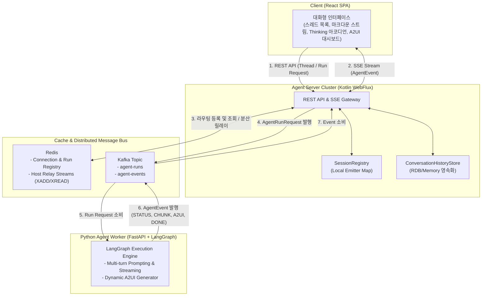

# 🏛️ 시스템 아키텍처 개요 (System Overview)

본 문서는 **대화형 AI 에이전트(ChatGPT형 UX)** 시스템의 전체 토폴로지, 구성 요소 및 `runId` / `messageId` 기반 메시지 라우팅 메커니즘을 정의합니다.

---

## 🏗️ 1. 전체 시스템 토폴로지 (System Topology)



---

## 🔄 2. 메시지 라우팅 및 시퀀스 흐름 (Message Flow)

```text
Client (React)          Server Node 1 (Host-1)     Redis Registry     Kafka Topic           Python Agent
  │                           │                       │                │                       │
  │── (1) POST /conversations ───────────────────────►│                │                       │
  │◄── 202 Created (conversationId="conv-123") ───────│                │                       │
  │                           │                       │                │                       │
  │── (2) GET /conversations/conv-123/events ────────►│                │                       │
  │    (SSE Connection Established)                   │                │                       │
  │◄── INIT (connectionId="conn-abc") ────────────────│                │                       │
  │                           │── registerConnectionHost("conn-abc", "Host-1") ───────────────►│
  │                           │                       │                │                       │
  │── (3) POST /conversations/conv-123/runs ─────────►│                │                       │
  │    {connectionId:"conn-abc", query:"질의 내용"}   │                │                       │
  │◄── 202 Accepted (runId="run-999") ────────────────│                │                       │
  │                           │── registerRunConnection("run-999", "conn-abc") ──────────────►│
  │                           │── Produce AgentRunRequest ("run-999") ───►│                     │
  │                           │                       │                │── Consume Run ───────►│
  │                           │                       │                │                       │ (LLM 추론)
  │                           │                       │                │◄── Produce AgentEvent │
  │                           │◄── Consume AgentEvent ("run-999") ─────│    (STATUS, CHUNK...) │
  │                           │── getConnectionByRun("run-999") ──────►│                       │
  │                           │◄── return "conn-abc" ──────────────────│                       │
  │                           │── getConnectionHost("conn-abc") ──────►│                       │
  │                           │◄── return "Host-1" (Local Match) ──────│                       │
  │◄── SSE Direct Delivery ───│                       │                │                       │
  │    (STATUS, CHUNK, A2UI)  │                       │                │                       │
```

---

## 🌐 3. 다중 노드 분산 릴레이 메커니즘 (Multi-Node Routing)

타깃 `connectionId`의 SSE 소켓이 본인 서버 노드가 아닌 타 노드(`Host-2`)에 위치할 경우:
1. `Host-1`은 Redis에서 `conn-abc`가 `Host-2`에 연결되어 있음을 조회합니다.
2. `Redis Streams` (`stream:host:Host-2`)로 이벤트를 `XADD` 릴레이합니다.
3. `Host-2` 노드가 `XREAD`로 수신받아 로컬 메모리의 해당 클라이언트 소켓으로 직통 배달(Direct Delivery)합니다.
