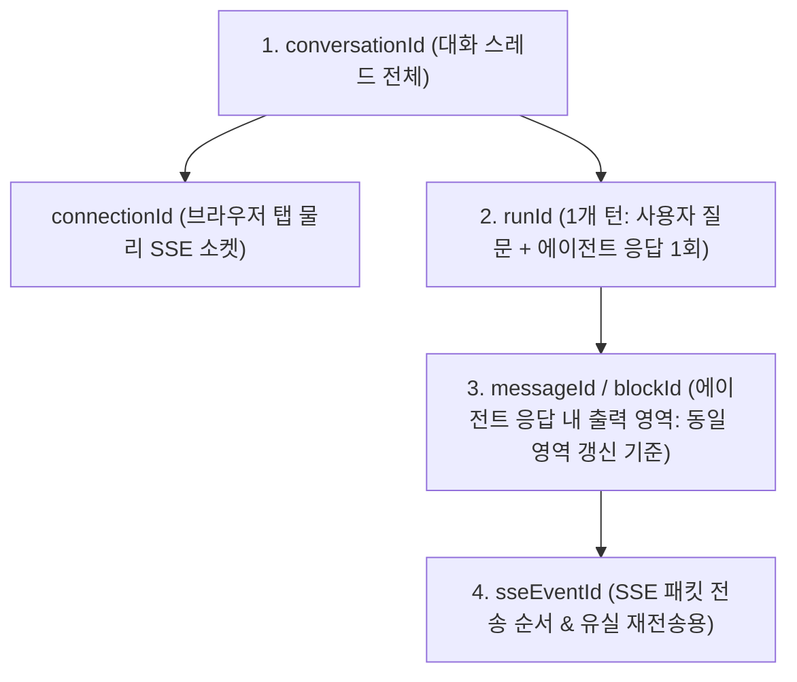
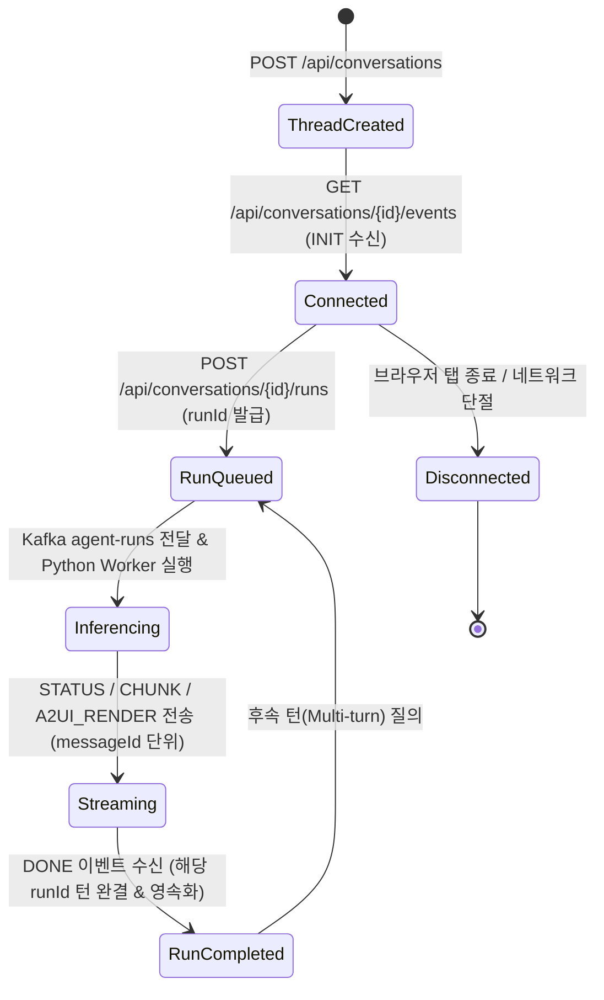

# 🔑 도메인 식별자 및 상태 생명주기 (Domain Identity & Lifecycle)

본 문서는 대화형 AI 에이전트 시스템에서 사용되는 **계층형 식별자 모델**과 **동일 영역 In-place 갱신 메커니즘**, **대화/이벤트 생명주기**를 정의합니다.

---

## 🔑 1. 계층형 식별자 모델 (Identity Hierarchy)

| 식별자 | 명칭 | 역할 및 생명주기 범위 | 생성 주체 | 갱신 및 동작 기준 |
|---|---|---|---|---|
| **`conversationId`** | 대화 스레드 ID | 사용자와 에이전트 간의 1개 대화 세션/스레드 단위 | Gateway Server (`conv-xxxx`) | 대화 목록 조회 및 전체 멀티턴 히스토리 복원 기준 |
| **`connectionId`** | SSE 연결 세션 ID | 클라이언트 브라우저 탭 1개의 물리적 SSE 소켓 연결 단위 | Gateway Server (`conn-xxxx`) | 게이트웨이 로컬 메모리 및 Redis 분산 라우팅 기준 |
| **`runId`** | 1개 턴(Run) ID | **사용자 요청 1건 ➔ 에이전트 1회 응답 완결(1 턴)** | Gateway Server (`run-xxxx`) | 사용자 질문 말풍선과 에이전트 응답을 하나의 턴으로 묶는 기준 |
| **`messageId`** | 응답 블록 ID | **에이전트 응답 내 특정 컴포넌트/영역 식별자** | Agent Worker (`msg-xxxx`) | **동일 `messageId`의 이벤트 수신 시 해당 영역 In-place 갱신(Replace)** |
| **`sseEventId`** | 전송 이벤트 ID | SSE 스트림을 통해 전송되는 개별 네트워크 패킷 식별자 | Agent / Gateway (`evt-xxxx`) | W3C SSE `id` 헤더 매핑 및 단절 시 재전송 복구 기준 |

---

## 🔄 2. 동일 영역 In-place 갱신 규칙 (`messageId`)

1. **Thinking 영역 (`messageId: "msg-think-1"`)**:
   - `STATUS` 이벤트가 도착할 때마다 아코디언 내부에 스텝을 시간순으로 누적 추가합니다.
2. **Markdown 텍스트 영역 (`messageId: "msg-report-1"`)**:
   - `CHUNK` 토큰이 도착할 때마다 해당 말풍선에 텍스트를 스트리밍 Append합니다.
3. **A2UI 대시보드 영역 (`messageId: "msg-a2ui-1"`)**:
   - 에이전트가 탐색 과정 중 초기 대시보드를 렌더링한 후, 추가 분석 결과로 업데이트된 대시보드를 동일한 `messageId: "msg-a2ui-1"`로 발행할 경우:
   - 프론트엔드는 카드를 새로 복제 생성하지 않고 **기존 카드의 내용을 새 데이터로 즉시 교체(Replace)**합니다.

---

## 🔄 3. 대화 및 턴 생명주기 (Conversation & Run Lifecycle)

