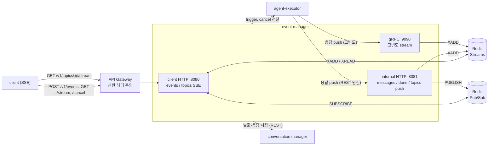
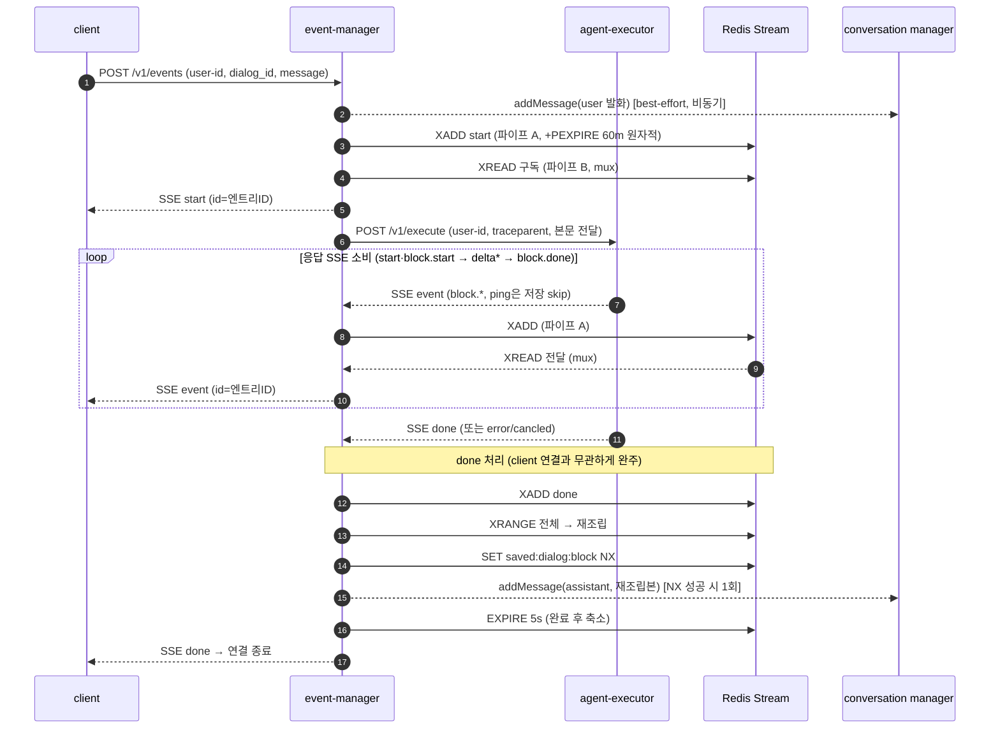
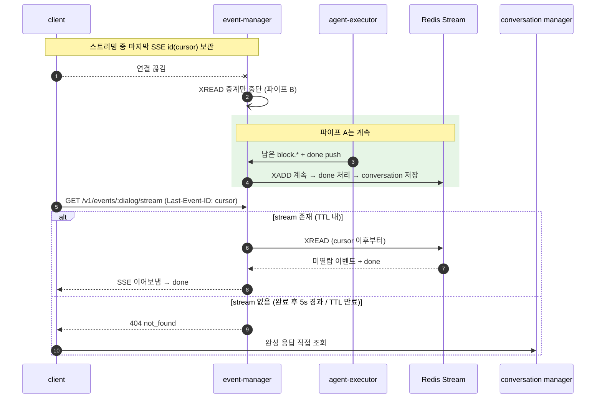
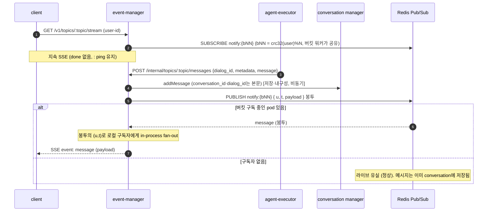
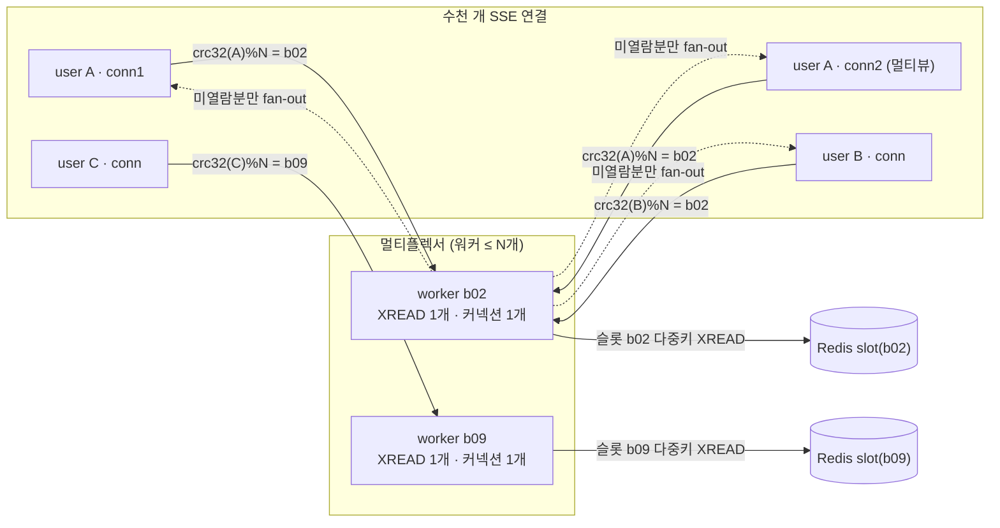
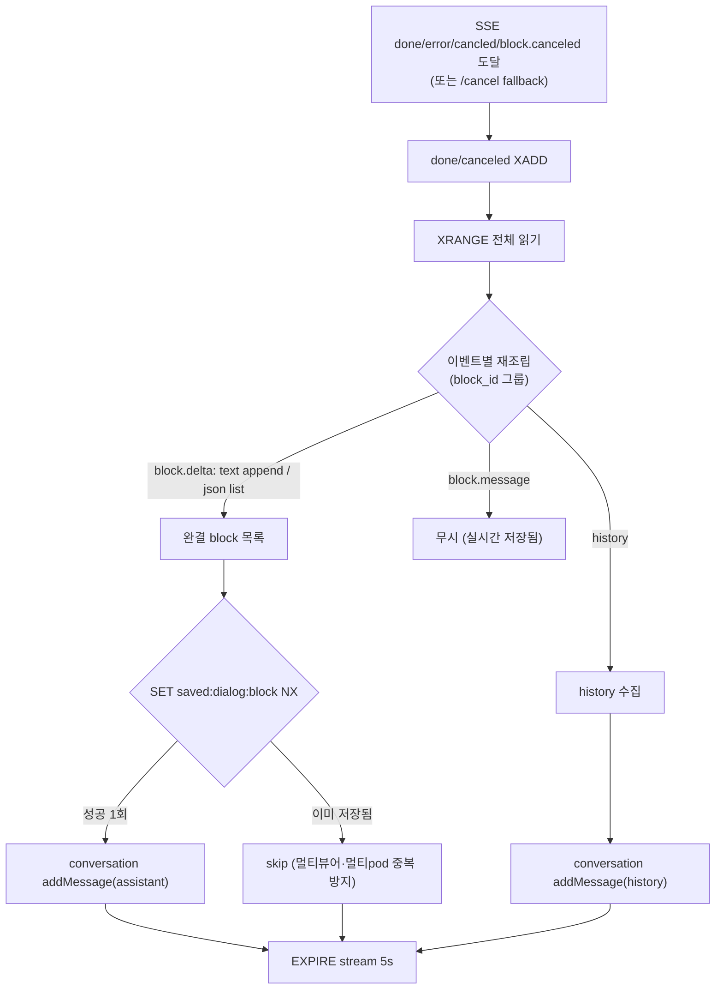

# Event Manager — Flow 다이어그램

구현(v4.1) 기준 흐름도. GitLab/IDE에서 Mermaid로 렌더된다.
계약 상세는 [`event-manager-api-spec.md`](event-manager-api-spec.md) 참조.

---

## 1. 아키텍처 — 컴포넌트와 두 쌍(pair)



- **events** 쌍: Redis **Stream**(무유실). client `/v1/events`·`.../stream`·`/cancel` ↔ EM이 agent-executor `POST /v1/execute` 호출 후 **응답 SSE 소비**(대안: internal push `/internal/events/*`·gRPC).
- **topics** 쌍: Redis **Pub/Sub**(best-effort). client `/v1/topics/:id/stream` ↔ agent-executor `/internal/topics/:id/messages`.

---

## 2. events — 정상 흐름 (발화 → 응답 → 저장)

두 파이프가 독립적인 것이 핵심: **XADD(파이프 A)** 와 **XREAD 중계(파이프 B)** 는 서로를 기다리지 않는다.



---

## 3. client 연결 종료 → 재연결 (무유실)

client가 끊겨도 **XADD·done·저장은 계속**된다. client는 커서로 이어본다.



---

## 4. topics — 구독 / 발행 (best-effort)



> **연결 상한**: 채널을 (user,topic)별이 아니라 **버킷 `notify:{bNN}`**(bNN =
> crc32(user)%N)로 두어, 한 pod가 여는 pub/sub 구독은 버킷 수(≤N)로 상한 고정된다.
> SSE 연결 10만 개라도 Redis 구독 커넥션은 pod×N 수준. 버킷당 워커 1개가 구독을
> 공유하고, 메시지 봉투 `{u,t,payload}`의 (user,topic)로 로컬 구독자에게 fan-out한다
> (events 멀티플렉서 §5와 동일한 커넥션 상한 원리, XREAD 대신 SUBSCRIBE). 유휴 워커는
> 은퇴해 구독을 회수한다. 클러스터에서 `{bNN}` 해시태그로 구독이 노드에 분산되며, 일반
> PUBLISH는 cluster bus로 전 노드에 전파된다(운영 Redis Cluster 6.2.16; 7.0+에선 sharded
> pub/sub로 bus 전파 제거 가능).

---

## 5. 멀티플렉서 — 버킷 해시태그로 커넥션 상한 고정

`stream:{bucket_N}:user:dialog`, `bucket_N = crc32(user_id) % N`. 같은 user는 같은 버킷(=슬롯).
버킷은 N개뿐 → **XREAD 워커·커넥션 수 = N 상한**(SSE 연결 수와 무관).



- 워커는 **최소 위치부터 읽고 각 구독자에게 미열람분만** 전달(순서·무중복). 느린 구독자는 drop → 재연결.
- 유휴 워커는 은퇴해 커넥션 회수.

---

## 6. done 처리기 — 재조립 & 1회 저장



---

## 렌더 방법
- **GitLab**: md 파일 열면 ```mermaid``` 블록 자동 렌더.
- **VS Code / JetBrains**: Mermaid 미리보기 플러그인 또는 마크다운 프리뷰.
- **로컬 이미지로 추출**: `mmdc`(mermaid-cli) 등으로 svg/png 변환.
