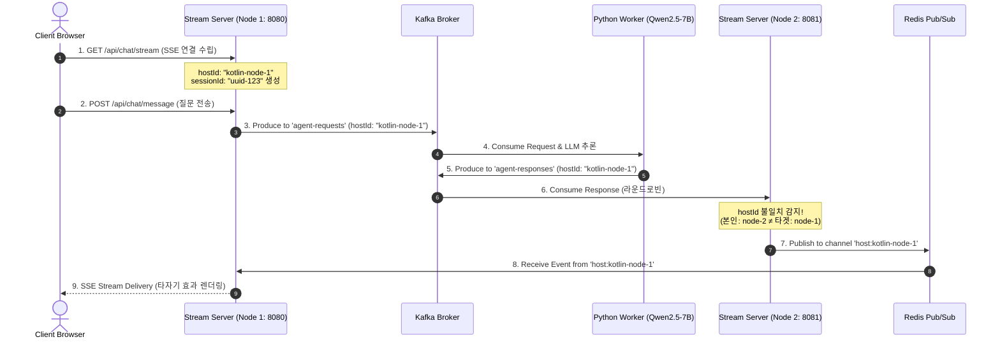

# 🧪 멀티 노드 세션 라우팅 테스트 가이드 (Multi-Node Session Routing Test Guide)

본 문서는 **Real-time AI Researcher Agent** 시스템이 분산 클러스터 환경(Multi-Instance)으로 스케일아웃되어 구동될 때, 사용자의 세션 및 SSE 커넥션이 Redis Pub/Sub을 거쳐 100% 정확한 노드로 교차 라우팅(Cross-Node Session Routing)되는지 검증하기 위한 기술 가이드입니다.

---

## 📌 1. 아키텍처 및 세션 라우팅 원리



---

## 🚀 2. 멀티 노드 클러스터 원클릭 실행

프로젝트 루트 디렉터리에서 스크립트를 실행하여 테스트용 2개 서버 노드 및 인프라, 파이썬 워커를 일괄 기동합니다.

```bash
./start-multi.sh
```

### 📊 기동되는 서비스 목록
* **Stream Server Node 1**: `http://localhost:8080` (`hostId`: `kotlin-node-xxxx`)
* **Stream Server Node 2**: `http://localhost:8081` (`hostId`: `kotlin-node-yyyy`)
* **Python Agent Worker**: 로컬 Ollama Qwen2.5-7B LLM 연동
* **Kafka Broker**: `localhost:9092`
* **Redis Pub/Sub**: `localhost:6379`

---

## 🧪 3. 자동화 라우팅 테스트 스크립트 실행

새 터미널 탭을 열고 아래 스크립트를 실행하여 자동화 검증을 수행합니다.

```bash
./scripts/test-multi-node-routing.sh
```

---

## 🔍 4. 콘솔 로그 검증 체크리스트

스크립트 실행 중 각 서버 노드의 터미널 출력 로그에서 아래 메시지를 확인합니다.

### ✅ Node 2 (8081 포트) 콘솔 로그
```text
[StreamService] 타 노드 메시지 감지 ➔ Redis Pub/Sub 라우팅 (본인=kotlin-node-2, 타겟=kotlin-node-1): sessionId=...
```
> **의미**: Node 2가 카프카에서 응답을 수신했으나 본인이 소켓을 가진 서버가 아니므로 Redis Pub/Sub 채널로 전송했음을 뜻합니다.

### ✅ Node 1 (8080 포트) 콘솔 로그
```text
[RedisRoutingService] Redis 채널 메시지 수신 (host:kotlin-node-1): type=CHUNK, sessionId=...
```
> **의미**: Node 1이 본인의 Redis 채널(`host:kotlin-node-1`)에서 이벤트를 수신하여 사용자의 SSE 커넥션으로 배달했음을 뜻합니다.

---

## 🛠️ 5. cURL 수동 테스트 시나리오

터미널에서 직접 cURL을 사용하여 개별 테스트를 진행할 수도 있습니다.

### Step 1. Node 1에 SSE 연결 수립 (터미널 A)
```bash
curl -sN http://localhost:8080/api/chat/stream
```
* 수신되는 `INIT` 이벤트에서 `sessionId` (예: `a1b2c3d4-5678...`)를 복사합니다.

### Step 2. Node 1로 질문 제출 (터미널 B)
```bash
curl -X POST http://localhost:8080/api/chat/message \
  -H "Content-Type: application/json" \
  -d '{
    "sessionId": "a1b2c3d4-5678...",
    "query": "멀티 노드 교차 라우팅 수동 테스트"
  }'
```

### Step 3. 결과 확인
터미널 A의 SSE 스트림에 `STATUS`, `CHUNK`, `A2UI_RENDER`, `DONE` 이벤트가 끊김 없이 정상 유입되는지 확인합니다.
