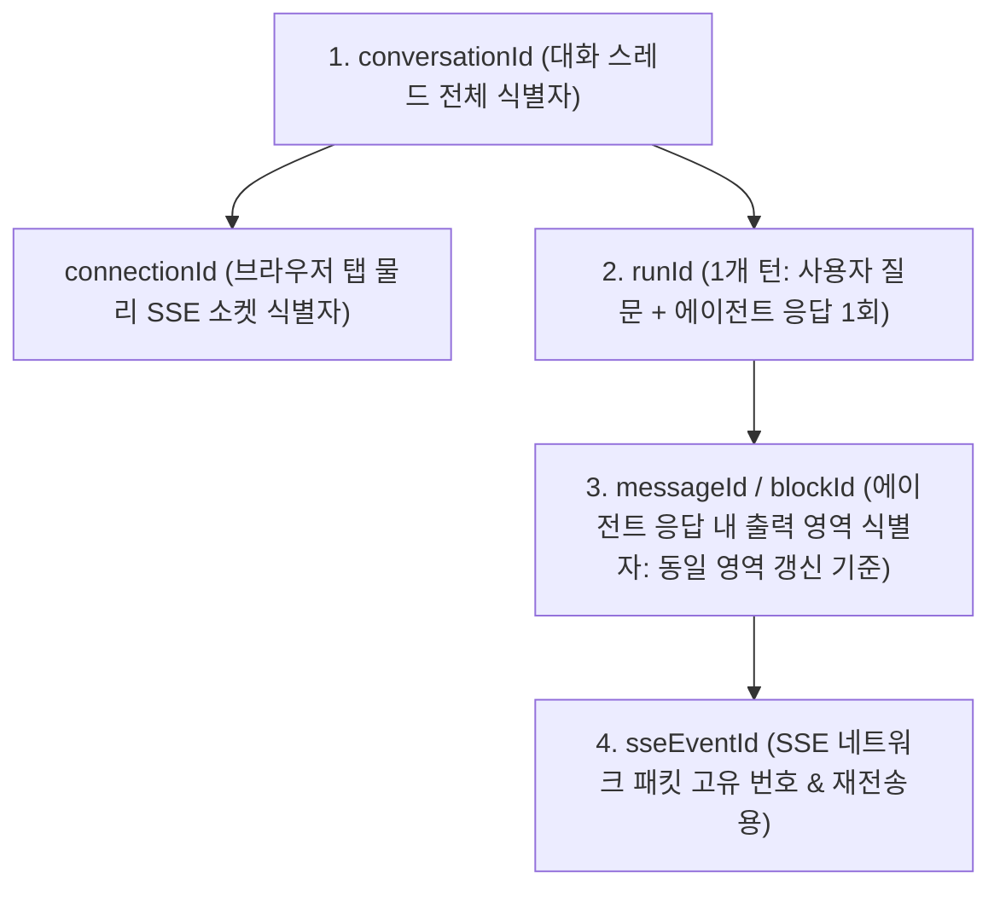

# 데이터 모델 명세서: 핵심 에이전트 스트리밍 및 AGUI 프로토콜

**대상 스펙**: [spec.md](./spec.md)  
**작성일자**: 2026-09-19 (식별자 체계 정립: runId, messageId, sseEventId)

---

## 1. 계층형 식별자 모델 (Identity Hierarchy)



| 식별자 | 명칭 | 타입 | 역할 및 비즈니스 범위 |
|---|---|---|---|
| **`conversationId`** | 대화 스레드 ID | `String (conv-xxxx)` | 1개 대화 세션 전체의 멀티턴 생명주기 및 이력 영속화 기준 |
| **`connectionId`** | SSE 연결 세션 ID | `String (conn-xxxx)` | 브라우저 탭 1개의 물리적 SSE 소켓 연결 단위 (게이트웨이 라우팅 기준) |
| **`runId`** | 1개 턴(Run) ID | `String (run-xxxx)` | **사용자 요청 1건 ➔ 에이전트 1회 응답 완결(1 턴)**을 묶는 실행 단위 |
| **`messageId`** | 응답 블록 ID | `String (msg-xxxx)` | **에이전트 응답 내 특정 컴포넌트/영역 식별자 (동일 영역 In-place 갱신 단위)** |
| **`sseEventId`** | 전송 이벤트 시퀀스 ID | `String (evt-xxxx)` | W3C SSE `id` 헤더에 매핑되는 단일 네트워크 패킷 순서 식별자 (재연결 시 복구용) |

---

## 2. DTO 및 메시지 페이로드 스키마

### 1) `AgentRunRequest` (클라이언트 ➔ 게이트웨이 ➔ Kafka `agent-runs`)
```json
{
  "runId": "run-80e29ebd-ad4d-421f",
  "conversationId": "conv-924821e7",
  "connectionId": "conn-3dc1ec63-a46f-49b2-9cb3-d67ce2044fb4",
  "type": "RESEARCH",
  "payload": {
    "query": "AGUI 스트리밍 아키텍처 알려줘"
  },
  "timestamp": 1726743600000
}
```

### 2) `AgentEvent` (에이전트 ➔ Kafka ➔ 게이트웨이 ➔ 클라이언트 SSE)
```json
{
  "sseEventId": "evt-7712a819",
  "runId": "run-80e29ebd-ad4d-421f",
  "conversationId": "conv-924821e7",
  "messageId": "msg-markdown-1",
  "type": "STATUS | CHUNK | A2UI_RENDER | DONE | ERROR | INIT",
  "content": "이벤트 내용 (텍스트 또는 A2UI JSON 문자열)",
  "metadata": {
    "title": "대화 스마트 타이틀 (DONE 시)",
    "step": "searching",
    "replace": false
  },
  "timestamp": 1726743601500
}
```
* **동일 영역 갱신 규칙**:
  * 동일한 `runId` 내에서 동일한 `messageId`를 가진 `A2UI_RENDER` 또는 `STATUS` 이벤트가 도착하면, 프론트엔드는 새로운 카드를 추가하지 않고 기존 영역의 내용을 **In-place 갱신(Replace/Update)**합니다.

### 3) `A2UI Schema v1.0` (선언적 동적 UI 스키마)
```json
{
  "version": "1.0",
  "messageId": "msg-a2ui-dashboard-1",
  "title": "📊 실시간 데이터 대시보드",
  "metrics": [
    {
      "id": "metric_1",
      "label": "분석 신뢰도",
      "value": "95%",
      "change": "+5%",
      "status": "success"
    }
  ],
  "action_section": {
    "title": "💡 추천 후속 탐색",
    "description": "원하시는 항목을 선택하면 탐색을 이어갑니다.",
    "options": [
      {
        "action_id": "action_detail",
        "label": "💻 실제 구현 코드 요청",
        "description": "프로젝트 샘플 코드를 생성합니다.",
        "payload": { "selected_option": "action_detail" }
      }
    ]
  }
}
```
